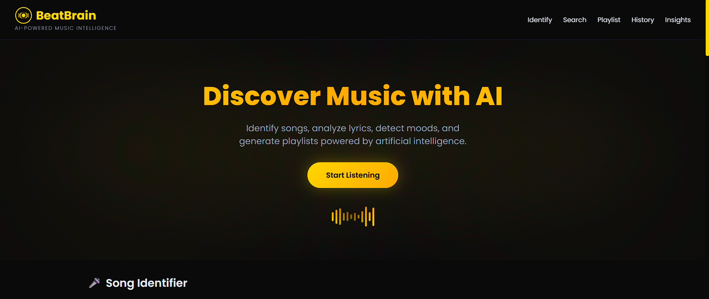
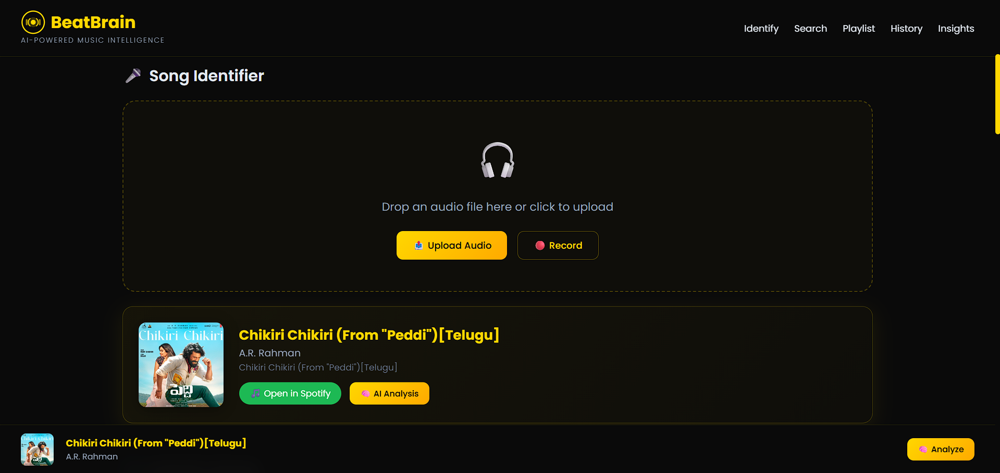
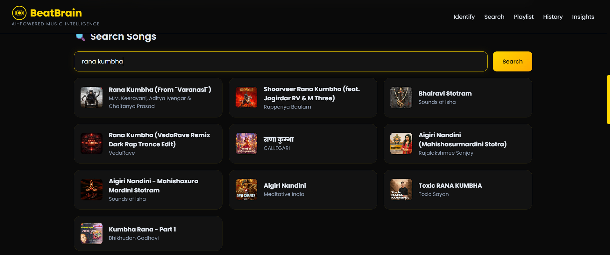
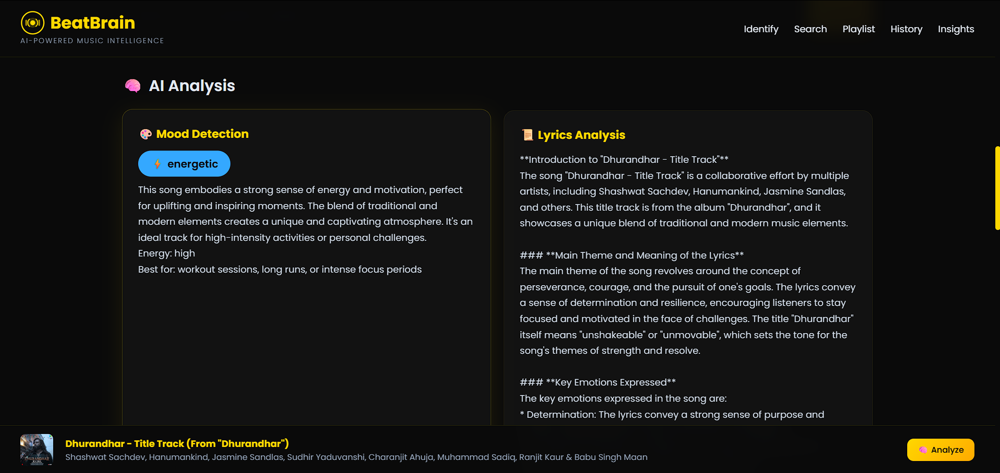
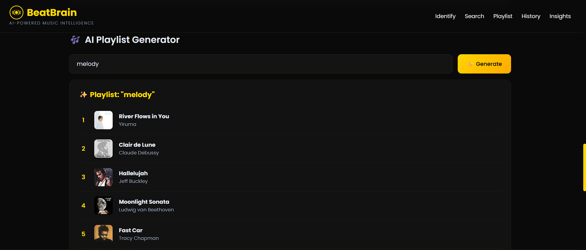

# BeatBrain - AI Music Intelligence

An AI-powered music platform that identifies songs, analyzes lyrics, detects mood, generates playlists and gives personalized listening insights. Built because Shazam wasn't cutting it for me.

## What it does

- **Song Identification** - Upload an audio file or record directly from browser to identify any song (powered by Shazam)
- **AI Lyrics Analysis** - Get a detailed breakdown of what the lyrics actually mean
- **Mood Detection** - AI figures out the mood, energy level and emotional vibe of any song
- **Smart Playlist Generator** - Describe a vibe and AI creates a 10-song playlist for you
- **Listening Insights** - AI analyzes your identification history and tells you about your music personality
- **Song Search** - Search any song and get album art, preview links

## Tech Stack

- **Backend**: Python, FastAPI
- **AI**: Groq API (Llama 3.3 70B)
- **Song Recognition**: Shazam (reverse-engineered API)
- **Music Search**: iTunes Search API
- **Database**: MySQL
- **Frontend**: HTML, CSS, JavaScript (single page app)

## Screenshots

### Hero


### Song Identifier


### Search


### AI Analysis (Mood + Lyrics)


### AI Playlist Generator


## Setup

### 1. Clone and install

```bash
git clone https://github.com/manojkumar-ra/beatbrain.git
cd beatbrain
pip install -r requirements.txt
```

### 2. Set up environment variables

Create a `.env` file:

```
GROQ_API_KEY=your_groq_api_key
MYSQL_HOST=localhost
MYSQL_USER=root
MYSQL_PASSWORD=your_password
MYSQL_DATABASE=beatbrain
```

- Get Groq API key from [console.groq.com](https://console.groq.com)
- Song identification uses Shazam (no API key needed)

### 3. Make sure MySQL is running

The app will automatically create the database and tables on first run.

### 4. Run

```bash
python main.py
```

Open `http://localhost:8000` in your browser.

## API Endpoints

| Method | Endpoint | Description |
|--------|----------|-------------|
| POST | `/api/identify` | Identify song from audio file |
| GET | `/api/search?q=query` | Search for songs |
| POST | `/api/analyze` | Get AI lyrics analysis + mood |
| POST | `/api/playlist` | Generate AI playlist from description |
| GET | `/api/history` | Get identification history |
| GET | `/api/insights` | Get AI listening insights |
| GET | `/health` | Health check |

## How the AI works

- Uses Groq's Llama 3.3 70B model for all AI features
- Lyrics analysis asks the AI to break down themes, emotions and literary devices
- Mood detection returns structured JSON with mood, energy level, color code
- Playlist generation creates diverse song lists based on natural language descriptions
- Insights analyzes your listening patterns and gives you a "music personality"

## Project Structure

```
beatbrain/
├── main.py              # FastAPI server and all routes
├── analyzer.py          # Groq AI functions (lyrics, mood, playlist, insights)
├── identifier.py        # Song identification (Shazam + AudD fallback)
├── spotify_client.py    # Song search using iTunes API
├── database.py          # MySQL connection and queries
├── requirements.txt     # Python dependencies
├── .env                 # API keys (not in repo)
├── .env.example         # Example env file
└── static/
    └── index.html       # Frontend (single page app)
```
